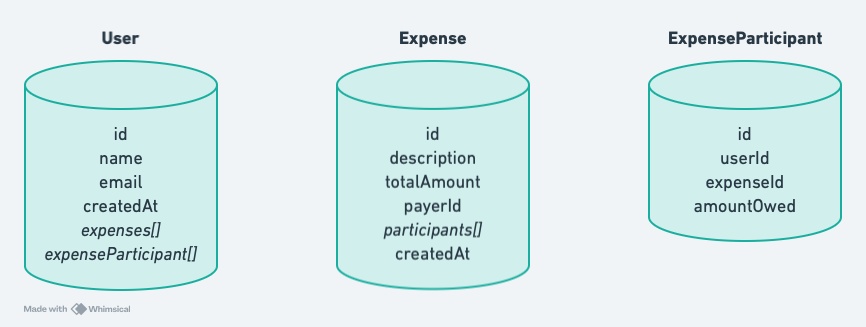

# Splittr - backend

## Steps to set up the project

```
npm install
npm run dev
```

```
npm run deploy
```

Create a `wrangler.toml` file in the backend directory with the following content

```toml
name = "backend"
compatibility_date = "2024-08-21"

[vars]
DATABASE_URL="<Prisma Accelerate API key>"
JWT_SECRET="<your secret>"
```

Create a .env file

```.env
DATABASE_URL="<database url>"
```

Data models



- **User** model - to represent every user of the app
- **Expense** model - to represent every expense
- **ExpenseParticipant** - to represent each participant in an expense

# Routes

## User routes

api prefix - `/api/v1/user`

### signup route

- api - `/signup`
- `POST` route
- request body
  ```json
  {
    "name": "John Doe",
    "email": "john@abc.xyz",
    "password": "******"
  }
  ```
- it will send back the jwt in the response body

### signin route

- api - `/signin`
- `POST` route
- request body
  ```json
  {
    "email": "john@abc.xyz",
    "password": "******"
  }
  ```
- it will send back the jwt in the response body

### get all users route

- api - `/bulk`
- `GET` route

## Expenses route

api prefix - `/api/v1/expenses`

### create expense

- api - `/`
- `POST` route
- response body
  ```json
  {
    "description": "test expense",
    "totalAmount": 1000,
    "payerId": "payer_id",
    "participants": [
        {
            "userId": "payer_id",
            "amountOwed": 200
        },
        {
            "userId": "participant_id",
            "amountOwed": 800
        }
    ]
  }
  ```

### get expenses for a user

- api - `/user/:userId`
- `GET` route

### get all expenses

- api - `/`
- `GET` route

### get specific expense

- api - `/:expenseId`
- `GET` route

### settle expense for a user

- api - `/:expenseId/settle/:userId`
- `PUT` route

### settle expense

- api - `/:expenseId/settle`
- `PUT` route

### get expense status for a user

- api - `/:expenseId/settled/:userId`
- `GET` route

### get expense status

- api - `/:expenseId/settled`
- `GET` route